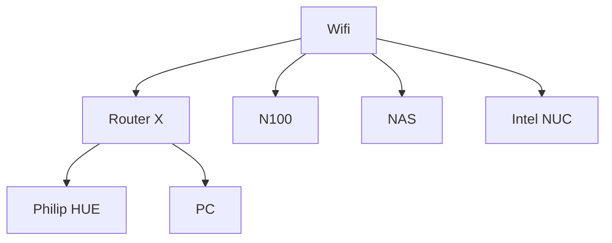
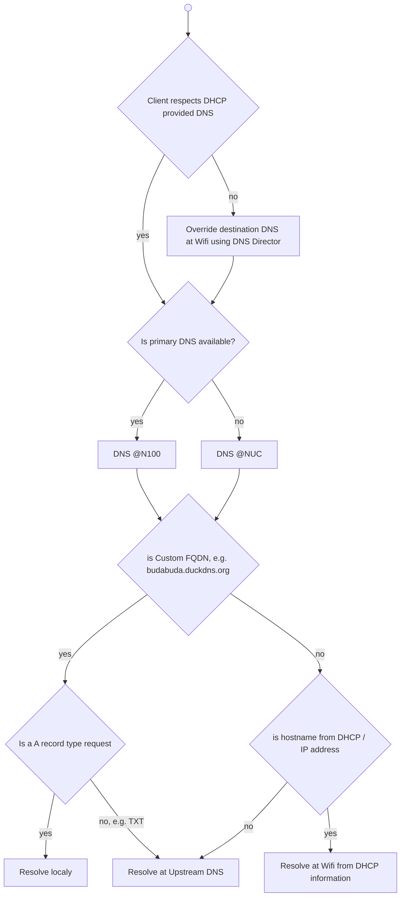

# Smarthome

**\*\*WORK IN PROGRESS\*\***

## Design

### Networking



### Compute

- N100 running Proxmox
  - HAOS with addons (containers)
  - Ubuntu running docker containers
- Intel NUC running docker containers

### DNS

- DHCP at Wifi serves 2 custom DNS
  - provided by Adguard Home
  - lives at N100 (primary) & Intel NUC (secondary)
  - synchronized using [Adguard Home Sync](https://github.com/bakito/adguardhome-sync)
  - DHCP hostname resolution is forwarded to the Wifi router
  - allows custom FQDN resolution
    - including subdomain / *, e.g. either resolve every subdomain if not defined using nuc.local record, or enable definition of a *.nuc.local record
  - TXT records resolution is forwarded to upstream DNS
 
    <details><summary>Adguard implementationdetails (click to expand)</summary>

    Apply custom filtering rules:
     
    ```txt
    # rewrite only A record, keep TXT records being resolved by upstream (i.e at the end duckdns.org)
    budabuda.duckdns.org^$dnsrewrite=192.168.1.7,dnstype=A
    budabudabot.duckdns.org^$dnsrewrite=192.168.1.7,dnstype=A
    ```
    </details>

  - Adguard safe search not used for youtube (otherwise Youtube comments are disabled)
 
- DNS MIM
  - some platforms do not use DNS provided by DHCP, e.g. Android uses Google DNS for data scraping
    - DNS director feature of Asus routers is used to override this, i.e. although client fires request to 8.8.8.8 router overrides the target and lets DHCP DNS resolve the request 
  - DNS must override budabuda.duckdns.org A records with local IP (so Let's encrypt certificates can be used internally), but allow forwarding of TXT records to upstream (for ACME DNS challenge)

<details><summary>DNS request flow (click to expand)</summary>



</details>

#### Other options considered

**\*\* TODO \*\***

|Name|Pihole|Adguard Home|Blocky|
|---|---|---|---|
|Description|- config using GUI only|- config using GUI / config file|- manual declarative configuration only|
|||- sync between instances available as a project||
|||- available as an HAOS addon||

### HTTP Load Balancing

- reverse proxy
- allows usage of Let's Encrypt DNS01 challenge
- DNS01 challenge integrates with DuckDNS (management of TXT records)
- ideally has interface to Docker for dynamic provisioning

#### Other options considered

**\*\* TODO \*\***

|Name|Nginx Proxy Manager|Traefik|Caddy|
|---|---|---|---|
|Description|- manual config using GUI|- static declarative configuration + first class dynamic integration with Docker|- manual declarative configuration only|
||- available as an HAOS addon|||

### Services

### Monitoring

### Backup

## Setup

- ansible
