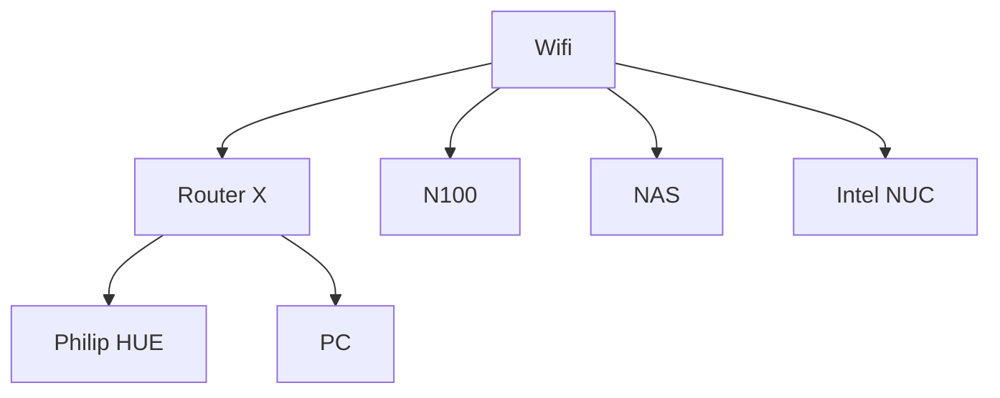
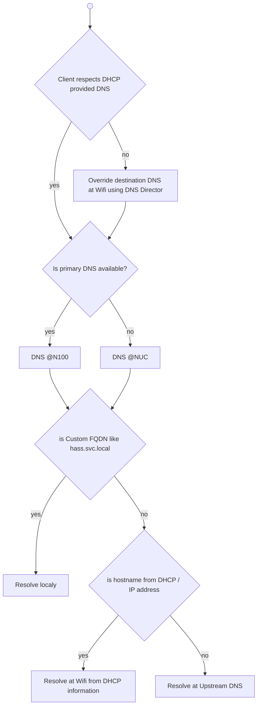

# Smarthome

## Design

### Networking

### Compute

- N100 running Proxmox
  - HAOS with addons (containers)
- Intel NUC running docker containers

### Services

### DNS

- DHCP at Wifi serves 2 custom DNS
  - provided by Adguard Home
  - lives at N100 (primary) / Intel NUC (secondary)
  - synchronized using [Adguard Home Sync](https://github.com/bakito/adguardhome-sync)
- DNS MIM
  - DNS must override budabuda.duckdns.org A records with local IP, but allow forwarding of TXT records to upstream (for ACME DNS challenge)
- upstream 

### HTTP Load Balancing

### Monitoring

### Backup

## Setup
