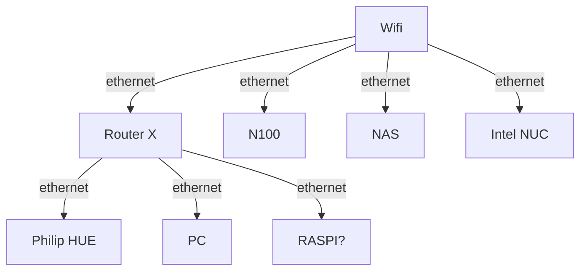
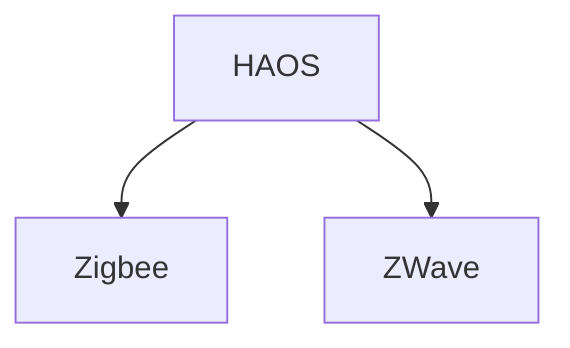
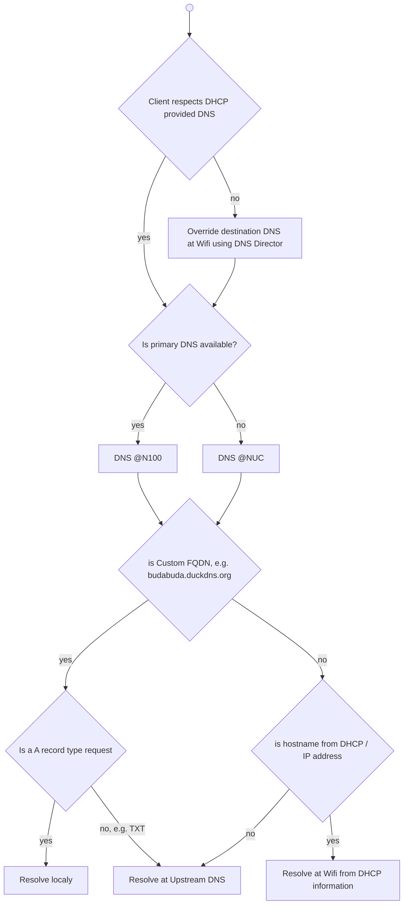
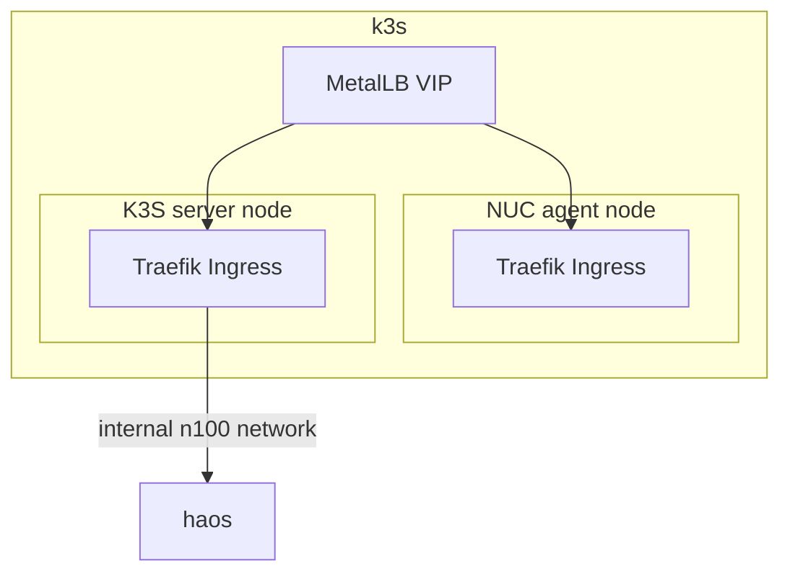
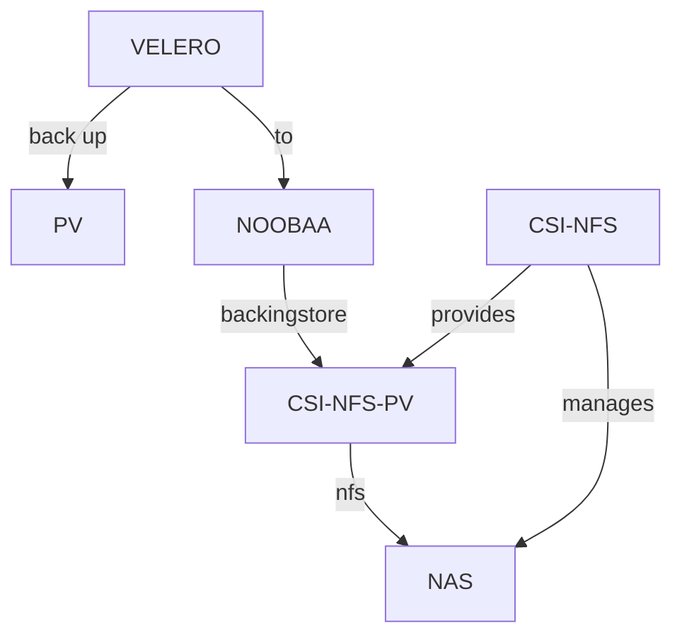

# Smarthome

**\*\*WORK IN PROGRESS\*\***

## Design

### Networking





### Compute

- Intel NUC running docker containers
- N100 running Proxmox
  - HAOS with addons (containers)
  - one of:

|Name|HAOS Addons|Talos OS|K3s|Proxmox LXC|Containers|
|---|---|---|---|---|---|
|Description|- running inside HAOS VM|- immutable OS, with declarative config|- running on top of Ubuntu|- Proxmox native|- running on top of Ubuntu|
||- nested virtualization|- nested virtualization|- nested virtualization|- **native virtualization**|- nested virtualization|
||- extremly easy|- interesting approach, could learn something new|- similar to RKE2|- probably harder management, upgrades|- same old approach|
||- lifecycle dependent on HAOS|- slightly higher resource usage than k3s|- very lightweight|- ultra lightweight||
|||- K8s *|- K8s *|- LXC containers|- Docker containers|

\* many new options, like gitops, operators ..

### DNS

- DHCP at Wifi serves 2 custom DNS
  - features
    - adblocking
    - malware blocking
    - safe search
    - parental control  
  - provided by Adguard Home
  - lives at N100 (primary) & Intel NUC (secondary)
  - synchronized using [Adguard Home Sync](https://github.com/bakito/adguardhome-sync)
  - DHCP hostname resolution is forwarded to the DHCP provider
  - allows custom FQDN resolution
    - including subdomain / *, e.g. either resolve every subdomain if not defined using parent record, e.g. budabuda.duckdns.org for everything.budabuda.duckdns.org, or enable definition of a asterisk record, i.e. *.budabuda.duckdns.org
  - TXT records resolution is forwarded to upstream DNS
 
    <details><summary>Adguard implementationdetails (click to expand)</summary>

    Apply custom filtering rules:
     
    ```txt
    # rewrite only A record, keep TXT records being resolved by upstream (i.e at the end duckdns.org)
    budabuda.duckdns.org^$dnsrewrite=192.168.1.7,dnstype=A
    budabudabot.duckdns.org^$dnsrewrite=192.168.1.7,dnstype=A
    ```
    </details>

  - Adguard safe search not used for youtube (otherwise Youtube comments are disabled)
 
- DNS MIM
  - some platforms do not use DNS provided by DHCP, e.g. Android uses Google DNS for data scraping
    - DNS director feature of Asus routers is used to override this, i.e. although client fires request to 8.8.8.8 router overrides the target and lets DHCP DNS resolve the request 
  - DNS must override budabuda.duckdns.org A records with local IP (so Let's encrypt certificates can be used internally), but allow forwarding of TXT records to upstream (for ACME DNS challenge)

<details><summary>DNS request flow (click to expand)</summary>



</details>

#### Other options considered

**\*\* TODO \*\***

|Name|Pihole|Adguard Home|Blocky|
|---|---|---|---|
|Description|- config using GUI and ENV|- config using GUI / config file|- manual declarative configuration only|
|||- sync between instances available as a project||
|||- available as an HAOS addon||

### Certificates

- use of Let's Encrypt certificates everywhere
- usage of DNS01 challenge required with duckdns.org (management of TXT records)

- services with native support
  - Proxmox
  - Nginx / Traefik / Caddy
 
- appliances without native support, i.e. certificate push required, e.g. using ansible running within Semaphore
  - Asus Wifi (missing DNS01 challenge)
  - Ubiquiti RouterX
  - NAS (Synology v6)

### HTTP Load Balancing

- used as reverse proxy for services running on Compute (N100, nuc)
- manages [Let's Encrypt certificate](#certificates)
- ideally has interface to Docker for dynamic provisioning

**\*\* TODO \*\***

|Name|Nginx Proxy Manager|Traefik|Caddy|
|---|---|---|---|
|Description|- manual config using GUI|- static declarative configuration|- manual declarative configuration only|
||- no Docker integration|- first class dynamic integration with Docker|- integration with Docker|
||- available as an HAOS addon|||



### Services

- N100
  - Semaphore (LXC)
  - HAOS
    - Uptime kuma
    - Zero tier
    - ZwareJS Server
  - Ubuntu
    - K3s
      - Nginx / Traefik / Caddy
      - Heimdall
      - Adguard
      - MQTT broker
      - Node-RED
      - Portainer
      - SSHwifty
      - Room Assistant ???
      - Ombi
      - ***arr
      - Jackett

- NUC
  - Adguard + Adguard sync
  - Duplicati
  - Nginx / Traefik / Caddy
  - Music Assistant + Squeeze lite
  - Jellyfin
  - Zero tier
  - Youtube DL
  - Prometheus + Blackbox exporter + Alertmanager <- to be deprecated
  - Room Assistant ???

### Monitoring

- Uptime Kuma
  - pings deviced
  - DNS resolving
    - primary DNS
      - custom DNS
      - DHCP DNS
      - Internet DNS
    - secondary DNS
      - custom DNS
  - https (with certicate expiration) for services
- Prometheus + Blackbox exporter + Alertmanager <- to be deprecated

- Telegram notification target

### Backup

- using HASS native backup with Telegram integration
- using Proxmox with webhook notification to hass endpoint to send notification to Telegram
- using Duplicati with Telegram integration on error / fatal

- appliance backup
  - wifi
  - routerx
  - pornonas
  - proxmox  

- k8s backup



or use host path duplicati

### Remote Access

- zerotier = current setup
- tailscale (uses Wireguard under the hood)

## Setup

### Automation

- targeting this repo
  - authentication using personal access tokens
    - validity monitoring ?

- ansible
  - running inside Semaphore
    - reads code + config from Gitrepo
    - secrets are local to Semaphore
 
- Gitops using ArgoCD

### Upgrades

- unattended Ubuntu upgrades
- monitoring for available upgrades
  - appliances
  - services

### Manual
