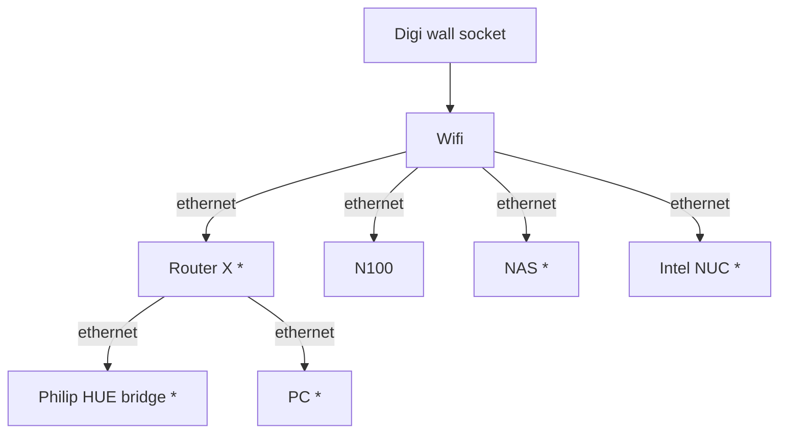
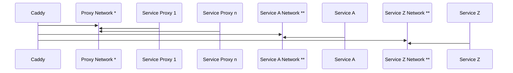
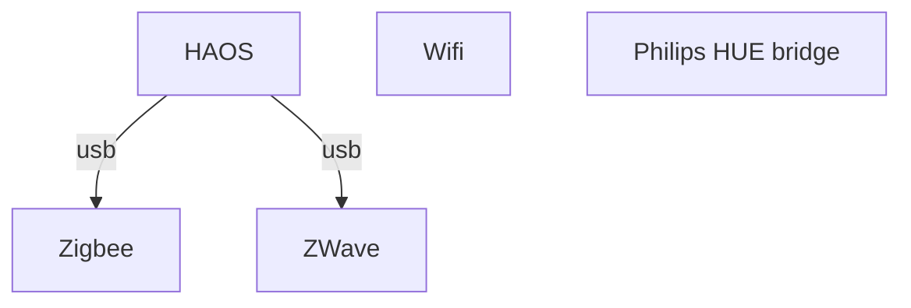
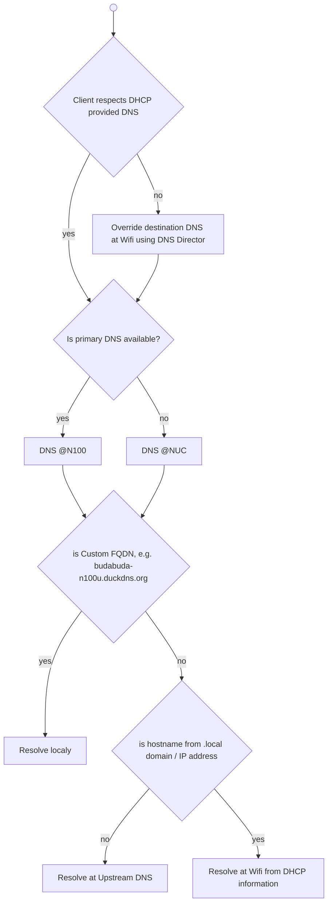

# Smarthome

**\*\*WORK IN PROGRESS\*\***

> [!NOTE]  
> repo uses git-crypt => please unlock first!

## Design

### Networking

#### Physical

```mermaid
flowchart TD

D[Digi wall socket]
W[Wifi]
D --> W
W --ethernet--> RX[Router X *]
W --ethernet--> N100
W --ethernet--> NAS[NAS *]
W --ethernet--> NUC[Intel NUC *]
RX --ethernet--> HUE[Philip HUE bridge *]
RX --ethernet--> PC[PC *]
```

\* turned off when off home

#### Logical Docker

```mermaid
sequenceDiagram

participant C as Caddy
participant PN as Proxy Network *
participant SP1 as Service Proxy 1
participant SPn as Service Proxy n
participant SAN as Service A Network **
participant SA as Service A
participant SZN as Service Z Network **
participant SZ as Service Z

C ->> PN :
SP1  ->> PN :
SPn  ->> PN :
C ->> SAN : 
SA  ->> SAN :
C ->> SZN : 
SZ  ->> SZN :
```

\* for services using OAUTH / OIDC  
\** for services using forward auth

#### Wireless

```mermaid
flowchart TD

HAOS --usb--> Zigbee
HAOS --usb--> ZWave

Wifi

HUE[Philips HUE bridge]
```

### Compute

- Intel NUC running Ubuntu with Docker containers
- N100 running Proxmox
  - HAOS with applications (containers)
  - Ubuntu with Docker containers

### DNS

- 2 DNS servers failover using keepalived
  - live at N100 (primary) & Intel NUC (secondary)
  - blocking status synchronized using Redis
- provided by [Blocky](https://github.com/0xERR0R/blocky) using IaC
  - adblocking
  - malware blocking
- DHCP hostname resolution @ .local domain is forwarded to the DHCP provider = Wifi
- custom FQDN resolution
- DNS requests (port 53) are overriden on Wifi (DNS Director) to use home DNS
  - exception are hosts hosting home DNS
- upstream Cloudflare (1.1.1.1) / Google (8.8.8.8)
 

DNS request flow (click to expand)

```mermaid
flowchart TD

  START@{ shape: sm-circ, label: "Small start" }
  RESPECT{Client respects DHCP provided DNS}
  START --> RESPECT

  DNS12{Is primary DNS available?}
  RESPECT -- yes --> DNS12

  DNSD[Override destination DNS at Wifi using DNS Director]
  RESPECT -- no --> DNSD
  DNSD --> DNS12

  DNS1[DNS @N100]
  DNS12 -- yes --> DNS1

  DNS2[DNS @NUC]
  DNS12 -- no --> DNS2
  
  CDNS{is Custom FQDN, e.g. budabuda-n100u.duckdns.org}
  DNS1 --> CDNS
  DNS2 --> CDNS

  LRESOLVE[Resolve localy]
  CDNS -- yes --> LRESOLVE

  UDNS[Resolve at Upstream DNS]


  DHCPDNS{is hostname from .local domain / IP address}
  CDNS -- no --> DHCPDNS
  DHCPDNS -- no --> UDNS

  WRESOLVE[Resolve at Wifi from DHCP information]
  DHCPDNS -- yes --> WRESOLVE
```

### Certificates

- use Let's Encrypt certificates everywhere
- usage of DNS01 challenge required with duckdns.org (management of TXT records)

- services with native support
  - Proxmox
  - Caddy

- appliances without native support, i.e. certificate push required, e.g. using ansible running within Semaphore
  - Asus Wifi (missing DNS01 challenge)
  - Ubiquiti RouterX
  - NAS (Synology v6)

### Reverse proxy

- used as reverse proxy for services running on compute
- uses Caddy
- manages [Let's Encrypt certificate](#certificates)

### Authentication

- uses Authelia
- OAUTH / OIDC used where possible
  - if not possible uses forward auth

### Services

- N100
  - HAOS
    - Netbird
    - Blocky + Keepalived
    - ZwareJS Server
  
- NUC
  - Authelia
  - Bazarr
  - Blocky
  - Caddy
  - Dockmon
  - Duplicati
  - Heimdall
  - Immich
  - Jackett
  - Jellyfin
  - Lidarr
  - Metube *
  - Mosquitto
  - Music Assistant *
  - Netbird
  - Node-RED
  - Ombi *
  - Peperless-NGX *
  - Radarr
  - Sablier
  - SSHwifty *
  - Sonarr
  - Uptime Kuma

  \* scale to zero after inactivity  when not used (via Sablier)

### Monitoring

- Uptime Kuma
  - pings deviced
  - DNS resolving
    - primary DNS
      - custom DNS
      - DHCP DNS
      - Internet DNS
    - secondary DNS
      - custom DNS
  - https (with certicate expiration) for services
  - healthchecks.io

- Telegram notification target

### Backup

- using HASS native backup with Telegram integration
- using Proxmox with webhook notification to hass endpoint to send notification to Telegram
- using Duplicati with Telegram integration on error / fatal

- appliance backup
  - wifi
  - routerx
  - pornonas
  - proxmox  

### Remote Access

- netbird
  - SDWAN
  - wireguard based
  - no public IP required
  - nuc, haos, yoga, phones connected

## TODO

[] Uptime Kuma migration to HAOS application = in case NUC is turned off => must keep on  
[] Redis sync for Blocky  
[] Enable SSO for all services / secure API services 
[] Migration to [Homepage](https://github.com/gethomepage/homepage) ? Currently Uptime Kuma integration requires status pages setup 🤦‍♂️  
[] [Zero toil](./zero-toil.md)  
[] Certs for appliance frontends using [scripts](./scripts/)  
[] k3s ?  
