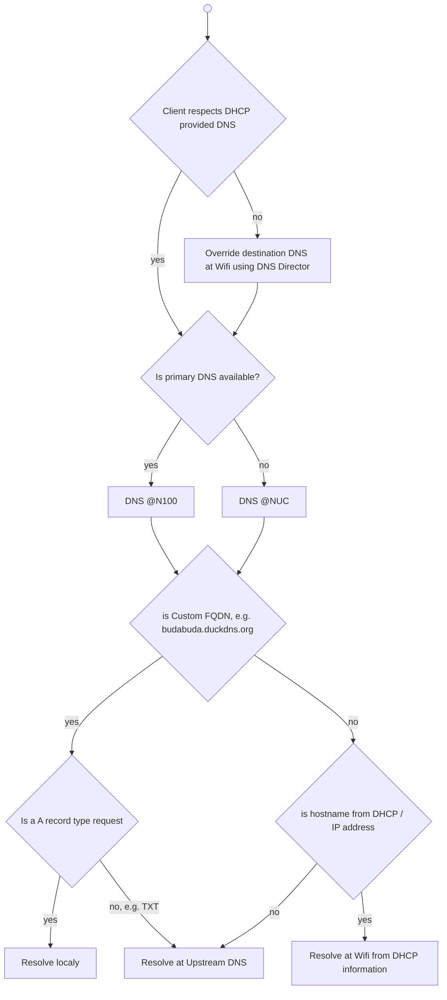

# Adguard Home

- DHCP at Wifi serves 2 custom DNS
  - features
    - adblocking
    - malware blocking
    - safe search
    - parental control
  - provided by Adguard Home
  - lives at N100 (primary) & Intel NUC (secondary)
  - DHCP hostname resolution is forwarded to the DHCP provider
  - allows custom FQDN resolution
    - including subdomain / *, e.g. either resolve every subdomain if not defined using parent record, e.g. budabuda.duckdns.org for everything.budabuda.duckdns.org, or enable definition of a asterisk record, i.e. *.budabuda.duckdns.org
  - TXT records resolution is forwarded to upstream DNS
 
    <details><summary>Adguard implementationdetails (click to expand)</summary>

    Apply custom filtering rules:
     
    ```txt
    # rewrite only A record, keep TXT records being resolved by upstream (i.e at the end duckdns.org)
    budabuda.duckdns.org^$dnsrewrite=192.168.1.7,dnstype=A
    budabudabot.duckdns.org^$dnsrewrite=192.168.1.7,dnstype=A
    ```
    </details>

  - Adguard safe search not used for youtube (otherwise Youtube comments are disabled)
 
- DNS MIM
  - some platforms do not use DNS provided by DHCP, e.g. Android uses Google DNS for data scraping
    - DNS director feature of Asus routers is used to override this, i.e. although client fires request to 8.8.8.8 router overrides the target and lets DHCP DNS resolve the request 
  - DNS must override budabuda.duckdns.org A records with local IP (so Let's encrypt certificates can be used internally), but allow forwarding of TXT records to upstream (for ACME DNS challenge)

<details><summary>DNS request flow (click to expand)</summary>



</details>
