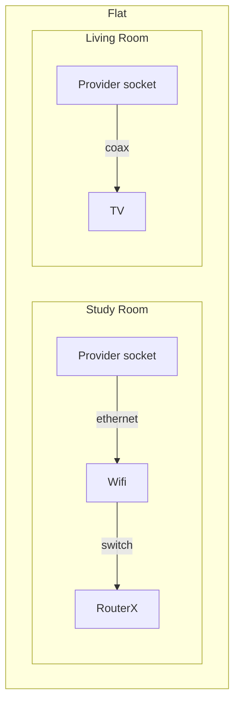
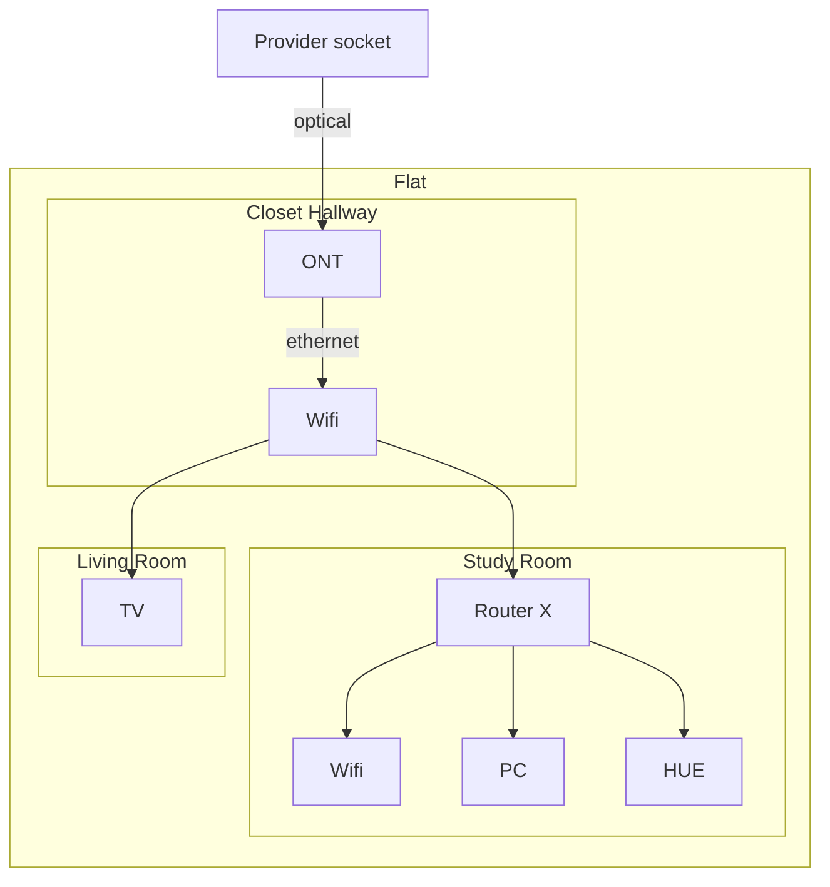

# Connectivity

<https://wfd.cloud.cambiumnetworks.com/wfdc/dashboard>

## Digi

```mermaid
flowchart TD


subgraph Flat

  subgraph Study Room
    P1[Provider socket]
    RX[RouterX]
    W2[Wifi]

    P1 -- ethernet --> W2
    W2 -- switch --> RX
  end

  subgraph Living Room
    P2[Provider socket]
    TV

    P2 -- coax --> TV
  end

end
```

## Non Digi

```mermaid
flowchart TD

P[Provider socket]

subgraph Flat

  subgraph Closet Hallway
    ONT
    W1[Wifi]
  end

  subgraph Study Room
    RX[Router X]
    W2[Wifi]
    PC
    HUE

    RX --> W2
    RX --> PC
    RX --> HUE
  end

  subgraph Living Room
    TV
  end

  W1 --> RX
  W1 --> TV

end

P -- optical --> ONT
ONT -- ethernet --> W1
```
