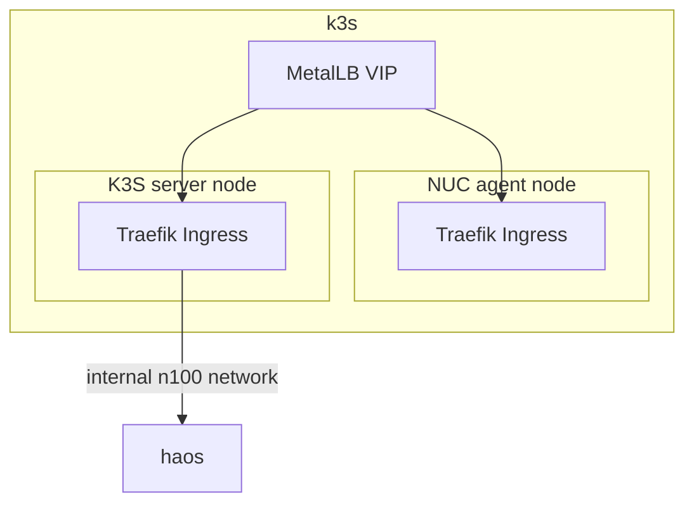
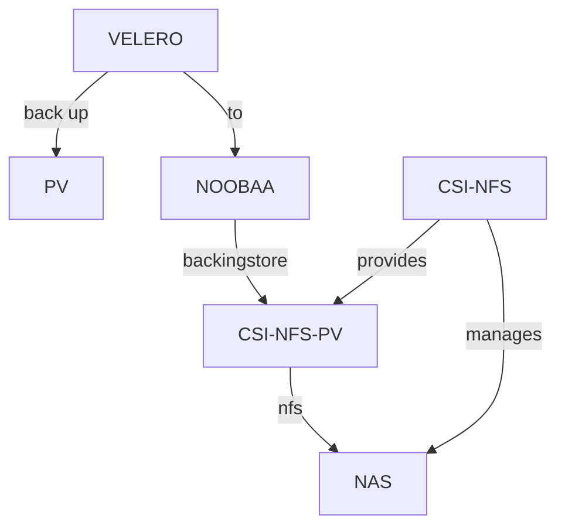

# K3s

## Fail over

```mermaid
flowchart TD

subgraph k3s

    VIP[MetalLB VIP] --> K3SI
    VIP --> K3SI2

    subgraph NUC agent node
        K3SI[Traefik Ingress]
    end

    subgraph K3S server node
        K3SI2[Traefik Ingress]
    end
end

K3SI2 -- internal n100 network--> haos
```

## Backup

```mermaid
flowchart TD

    VELERO --back up--> PV
    VELERO --to --> NOOBAA
    NOOBAA --backingstore--> CSI-NFS-PV
    CSI-NFS --provides--> CSI-NFS-PV
    CSI-NFS --manages--> NAS
    CSI-NFS-PV --nfs--> NAS
```

or use host path duplicati
